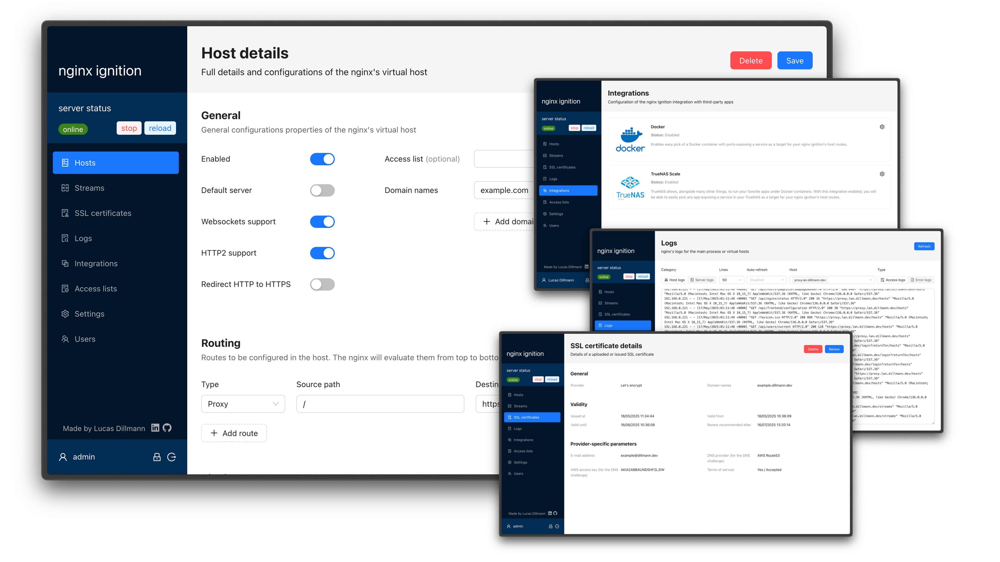

<p align="center">
    
</p>
<h1 align="center">
    nginx ignition
</h1>

The nginx ignition is a user interface for the nginx web server, aimed at developers and enthusiasts that don't
want to manage configuration files manually for their use-cases. 

Although it isn't the goal to be feature-complete (if your use-case is quite advanced or complex, you probably will not 
use a UI anyway), the project does aim to provide an intuitive and powerful way to configure and run nginx.

Some of the available features include:
- Multiple nginx virtual hosts, each one with its customized set of domains, routes and bindings (port listeners)
- Multiple nginx streams (for proxying raw TCP, UPD and unix sockets traffic), each one with its customized binding and
  backing service
- Each host route can act as a proxy, redirection, execute custom code (JavaScript or Lua), reply with a static 
  response or serve static files (directory listing can be optionally enabled)
- Easy configuration of the nginx server (maximum body/upload size, server tokens, timeouts, log level, etc)
- SSL certificates (Let's Encrypt, self-signed or bring your custom one) with automatic renew (when applicable)
- Server and virtual hosts access and error logs with automatic log rotation
- Multiple users with attribute-based access control (ABAC)
- Native integration with TrueNAS Scale, allowing to easily configure to proxy to an app hosted in your NAS
- Native integration with Docker for easy pick of a container as the proxy target
- Access lists for easy control of who can access what using basic authentication and/or source IP address checks 

## Getting started

To run nginx ignition, run the following in your terminal. If you don't have Docker already, you will need to install 
it first (follow [this link](https://www.docker.com/get-started/) for instructions).

```shell
docker run -p8090:8090 -p80:80 dillmann/nginx-ignition
```

After a few seconds, you can open your favorite browser at http://localhost:8090 and start using it. There's no 
default username or password, the nginx ignition will guide you to create your user.

Please note that in its default configuration the app will start using an embedded SQLite database. While this is fine
for testing and some experiments, is not recommended for a long-term scenario. For that, please refer to the 
configuration section below to use PostgreSQL instead.

## Migrating from 1.x to 2.0.0

If you're using any 1.x version of the nginx ignition and plans to upgrade to 2.0.0, please check 
[this migration guide](docs/migration-guide.md) for instructions and important notes on where to do it.

## Configuration

Check [this documentation file](docs/configuration-properties.md) for more details about the available configuration 
properties and some common use-case examples.

## Troubleshooting

Check [this documentation file](docs/troubleshooting.md) for more details about how to troubleshoot the application
and some common recovery operations, like resetting your password.

## Contributing and feedback

Feel free to open an issue or pull request here at GitHub or to send me a message through
[my LinkedIn profile](https://linkedin.com/in/lucasdillmann) to share some feedback. Every constructive one is welcome.
