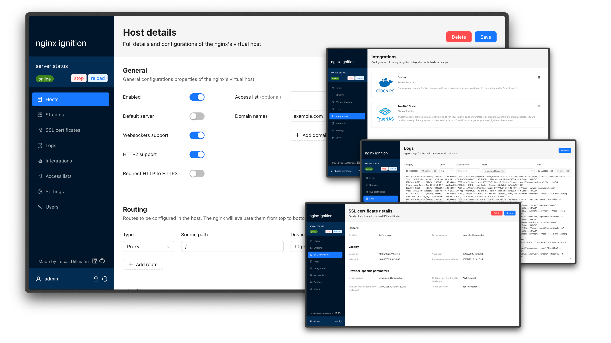

<p align="center">
    
</p>

<h1 align="center">nginx ignition</h1>

<br />

<p align="center">
    <strong>A modern, intuitive user interface for the nginx web server.</strong><br />
    Designed for developers and enthusiasts who want powerful control without the manual config headache.
</p>

<br />

## 🧰 Batteries included

- 🌐 **Virtual hosts:** Easily manage multiple hosts with custom domains, routes, and port bindings.
- 🔄 **Streams:** Proxy TCP, UDP, and Unix sockets with SNI-based routing, circuit breakers, and load balancing.
- ⚡ **Versatile routing:** Configure proxies, redirections, custom JS/Lua code, static responses, or file serving.
- ⚙️ **Server configuration:** Easy configuration of the nginx server (maximum body/upload size, server tokens, 
     timeouts, log level, etc).
- 🔐 **SSL certificates:** Automated Let's Encrypt (ACME), self-signed, or bring your own certificates.
- 🐳 **Native integrations:** First-class support for Docker, Docker Swarm, Tailscale and NetBird VPNs, and TrueNAS.
- 🛡️ **Security:** Secure access with two-factor authentication, attribute-based access control (ABAC) and per-host 
     access lists using basic authentication and source IP checks.
- 📋 **Logging:** Detailed access and error logs for the server and each virtual host, with built-in automatic log 
     rotation.
- 📊 **Traffic statistics:** Real-time insights into server performance, including request rates, response times, and 
     traffic breakdown by host, domain, and upstream servers.
- 🚀 **Caching:** Built-in nginx caching configuration to speed up your content delivery.
- 🏗️ **Flexible execution:** nginx ignition can run nginx for you, or just generate the configuration files for you.

<br />

## 🌐 Multi-language support

nginx ignition supports multiple languages, including:

- 🇧🇷 Brazilian Portuguese
- 🇺🇸 English
- 🇨🇳 Chinese (Simplified)
- 🇩🇪 German
- 🇫🇷 French
- 🇮🇳 Hindi
- 🇪🇸 Spanish
- 🇻🇳 Vietnamese
- 🇷🇺 Russian
- 🇧🇩 Bengali
- 🇯🇵 Japanese

<br />

> This is currently a **beta feature**. If you find any translation issues or have suggestions for improvements, please 
> feel free to [raise an issue](https://github.com/lucasdillmann/nginx-ignition/issues). If you'd like to see a new 
> language added, please [start a discussion](https://github.com/lucasdillmann/nginx-ignition/discussions).

<br />

## 🎯 Goals

nginx ignition is **built for developers and enthusiasts** who want a balance between ease of use and the power of nginx.
This project is **not aimed at being enterprise-ready or feature-complete for highly complex environments**. If 
your use-case is extremely advanced, you'll likely prefer managing configuration files manually.

Our goal is to provide a powerful, yet intuitive way to run nginx for the most common use-cases with some optional, 
nice-to-have features that can help you get your homelab up and running quickly.

<br />

## 🚀 Run it for a quick test

Getting up and running to check out if nginx ignition is for you can be done using a single Docker command.

```shell
docker run -p 8090:8090 -p 80:80 dillmann/nginx-ignition
```

1.  Wait a few seconds for the app to initialize.
2.  Open **[http://localhost:8090](http://localhost:8090)** in your browser.
3.  The setup wizard will guide you through creating your first user.

<br />

> By default, an embedded SQLite database is used. For production environments we recommend using PostgreSQL. 
> Check the [database configuration](docs/configuration-properties.md) documentation for more details on how to do it.

<br />

## 📦 All installation options for Linux, Windows, and macOS

Choose the method that best fits your environment, be it Docker, Docker Compose, native packages for Linux, Windows, 
or macOS.

### Docker Compose (recommended)
Use our [docker-compose.yml](docker-compose.yml) for a production-ready setup with PostgreSQL and health checks.

### Native packages for Linux, Windows, and macOS
Download the latest version for your architecture from the [releases page](https://github.com/lucasdillmann/nginx-ignition/releases):

| Platform           | Package type   | Arch         |
|:-------------------|:---------------|--------------|
| **Debian, Ubuntu** | `.deb`         | amd64, arm64 |
| **RedHat, Fedora** | `.rpm`         | amd64, arm64 |
| **Alpine Linux**   | `.apk`         | amd64, arm64 |
| **Arch Linux**     | `.pkg.tar.zst` | amd64, arm64 |
| **OpenWrt**        | `.ipk`         | amd64, arm64 |
| **Windows**        | ZIP archive    | amd64, arm64 |
| **macOS**          | ZIP archive    | arm64        |

<br />

## 🛠️ Advanced configuration

Need to tune your setup? Explore our detailed guides:

- 📜 **[Configuration properties](docs/configuration-properties.md):** Full list of available environment variables and configuration properties.
- 🏥 **[Health checks](docs/health-checks.md):** Monitor your instance's status.
- 🔍 **[Troubleshooting](docs/troubleshooting.md):** Common issues and recovery steps (like password resets).
- 🔁 **[Migrating from v1 to v2](docs/migration-guide.md):** Steps to upgrade from nginx ignition v1 to v2.

<br />

## 💖 Sponsors

We are grateful to our sponsors for supporting the development of nginx ignition:

- [**Greptile**](https://www.greptile.com/): AI-powered code review agent that understands ignition's codebase, 
  providing deep, context-aware insights to help us catch bugs and accelerate development.

<br />

## 🤝 Contributing and feedback

We love to hear and receive feedback from you. Whether it's a bug report, a feature request, or a pull request:

- 🛠️ **[Open an issue](https://github.com/lucasdillmann/nginx-ignition/issues)** if you have a problem or bug to report
- 💬 **[Start a discussion](https://github.com/lucasdillmann/nginx-ignition/discussions)** if you have a question or feature request
- 👋 **[Say hello on LinkedIn](https://linkedin.com/in/lucasdillmann)** if you want to share some feedback

<br />

##

<p align="center" style="font-size: 10px">
    Made with ❤️ from Brazil. We hope nginx ignition can solve some problems for you and make your homelab a bit 
    simpler.
</p>
